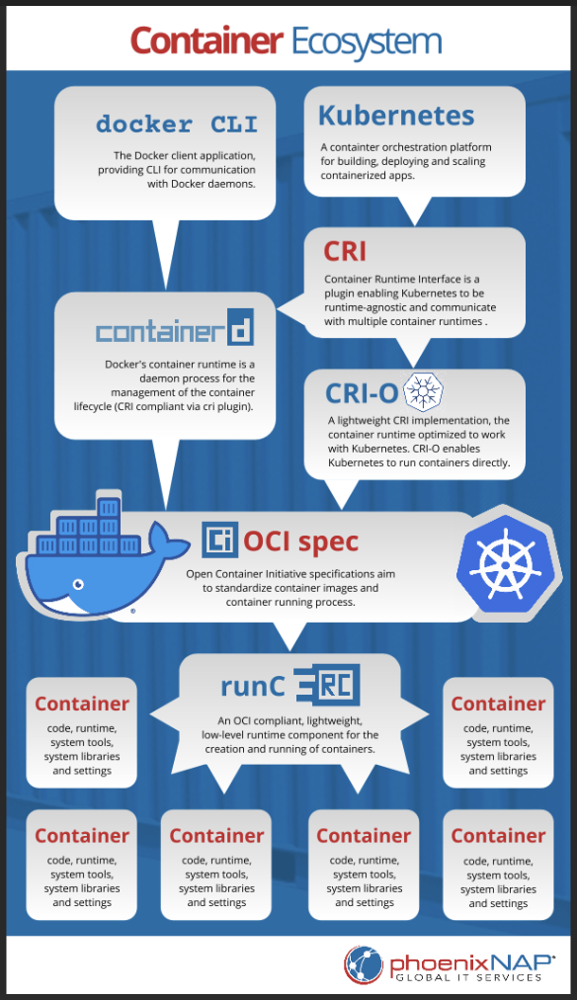

# :whale2: Install the `CRI` `containerd.io`

 </img>

## :a: [Install using the Docker apt repository](https://docs.docker.com/engine/install/ubuntu/#install-using-the-repository)

:round_pushpin: Update the apt package index and install packages to allow apt to use a repository over HTTPS:

```
sudo apt-get update && sudo apt-get install ca-certificates curl gnupg
```
> Returns :
```yaml
Hit:1 http://ports.ubuntu.com/ubuntu-ports jammy InRelease
Hit:3 http://ports.ubuntu.com/ubuntu-ports jammy-updates InRelease
Hit:4 http://ports.ubuntu.com/ubuntu-ports jammy-backports InRelease
Hit:5 http://ports.ubuntu.com/ubuntu-ports jammy-security InRelease               
Hit:2 https://packages.cloud.google.com/apt kubernetes-xenial InRelease           
Reading package lists... Done
Reading package lists... Done
Building dependency tree... Done
Reading state information... Done
ca-certificates is already the newest version (20211016ubuntu0.22.04.1).
curl is already the newest version (7.81.0-1ubuntu1.10).
gnupg is already the newest version (2.2.27-3ubuntu2.1).
gnupg set to manually installed.
0 upgraded, 0 newly installed, 0 to remove and 0 not upgraded.
```

## :b: Install the `containerd.io` package

- [ ] Install

```
sudo apt install containerd.io
```
> Returns :
```yaml
Reading package lists... Done
Building dependency tree... Done
Reading state information... Done
containerd.io is already the newest version (1.6.21-1).
0 upgraded, 0 newly installed, 0 to remove and 3 not upgraded.
```

- [ ] Check that the `containerd` service is available at startup

```
systemctl is-enabled containerd
```
> enabled

## :ab: Setting the `CGROUPv2` for `Systemd`

- [ ] Goal: Fix `cgroup` related to `Systemd` [:bangbang: Issues with "stability" with Kubernetes cluster before adding networking](https://stackoverflow.com/questions/72567945/issues-with-stability-with-kubernetes-cluster-before-adding-networking/73743910#73743910)

:round_pushpin: Is the system using [`cgroup2`](https://kubernetes.io/docs/concepts/architecture/cgroups/#check-cgroup-version)? (if not, `tmpfs` is displayed)

```
stat -fc %T /sys/fs/cgroup/
```
> cgroup2fs

:round_pushpin: Display the configuration file `config.toml` to modify

```
sudo cat /etc/containerd/config.toml
```
> Returns :
```toml
#   Copyright 2018-2022 Docker Inc.

#   Licensed under the Apache License, Version 2.0 (the "License");
#   you may not use this file except in compliance with the License.
#   You may obtain a copy of the License at

#       http://www.apache.org/licenses/LICENSE-2.0

#   Unless required by applicable law or agreed to in writing, software
#   distributed under the License is distributed on an "AS IS" BASIS,
#   WITHOUT WARRANTIES OR CONDITIONS OF ANY KIND, either express or implied.
#   See the License for the specific language governing permissions and
#   limitations under the License.

disabled_plugins = ["cri"]

#root = "/var/lib/containerd"
#state = "/run/containerd"
#subreaper = true
#oom_score = 0

#[grpc]
#  address = "/run/containerd/containerd.sock"
#  uid = 0
#  gid = 0

#[debug]
#  address = "/run/containerd/debug.sock"
#  uid = 0
#  gid = 0
#  level = "info"
```

:round_pushpin: Configure `containerd`

* Change configuration file `/etc/containerd/config.toml` to use `CGROUP`s with `SystemD`

```
containerd config default | sudo tee /etc/containerd/config.toml
```

* Change the `CGroup` to `true`

```
sudo sed -i 's/SystemdCgroup \= false/SystemdCgroup \= true/g' /etc/containerd/config.toml
```

* Check that the `CGroup` is set to `true`

```
sudo cat /etc/containerd/config.toml | grep SystemdCgroup
```
>            SystemdCgroup = true


- [ ] As a precaution restart the `containerd` service

```
sudo systemctl restart containerd
```

- [ ] Check the `containerd` service

```
systemctl status containerd
```
> Returns :
```yaml
● containerd.service - containerd container runtime
     Loaded: loaded (/lib/systemd/system/containerd.service; enabled; vendor preset: enabled)
     Active: active (running) since Wed 2023-05-24 18:53:11 UTC; 5s ago
       Docs: https://containerd.io
    Process: 173991 ExecStartPre=/sbin/modprobe overlay (code=exited, status=0/SUCCESS)
   Main PID: 173992 (containerd)
      Tasks: 10
     Memory: 12.8M
        CPU: 262ms
     CGroup: /system.slice/containerd.service
             └─173992 /usr/bin/containerd

May 24 18:53:11 rukbat containerd[173992]: time="2023-05-24T18:53:11.744926969Z" level=info msg="Start subscribing containerd event"
May 24 18:53:11 rukbat containerd[173992]: time="2023-05-24T18:53:11.745227798Z" level=info msg="Start recovering state"
May 24 18:53:11 rukbat containerd[173992]: time="2023-05-24T18:53:11.745636346Z" level=info msg="Start event monitor"
May 24 18:53:11 rukbat containerd[173992]: time="2023-05-24T18:53:11.745745566Z" level=info msg="Start snapshots syncer"
May 24 18:53:11 rukbat containerd[173992]: time="2023-05-24T18:53:11.745801269Z" level=info msg="Start cni network conf syncer for default"
May 24 18:53:11 rukbat containerd[173992]: time="2023-05-24T18:53:11.745853638Z" level=info msg="Start streaming server"
May 24 18:53:11 rukbat containerd[173992]: time="2023-05-24T18:53:11.747637867Z" level=info msg=serving... address=/run/containerd/containerd.sock.ttrpc
May 24 18:53:11 rukbat containerd[173992]: time="2023-05-24T18:53:11.748188394Z" level=info msg=serving... address=/run/containerd/containerd.sock
May 24 18:53:11 rukbat systemd[1]: Started containerd container runtime.
May 24 18:53:11 rukbat containerd[173992]: time="2023-05-24T18:53:11.755845001Z" level=info msg="containerd successfully booted in 0.088282s"
```

* hit `q` to quit

## :warning: Reboot the machine

```
sudo reboot -n now
```

## [:back:](../README.md#round_pushpin-installing-services)

# References

- [ ] [Updated: Dockershim Removal FAQ](https://kubernetes.io/blog/2022/02/17/dockershim-faq/)
- [ ] [How to Install Containerd on Ubuntu 22.04 / Ubuntu 20.04](https://www.itzgeek.com/how-tos/linux/ubuntu-how-tos/install-containerd-on-ubuntu-22-04.html)
- [ ] [Configuring the systemd cgroup driver](https://kubernetes.io/docs/setup/production-environment/container-runtimes/#containerd-systemd)
- [ ] [if not add "version = 2" to the /etc/containerd/config.toml, some configuration will be ingored](https://github.com/containerd/containerd/issues/5237)

```
containerd --version
```
> containerd containerd.io 1.6.21 3dce8eb055cbb6872793272b4f20ed16117344f8


```
runc --version
```
```yaml
runc version 1.1.7
commit: v1.1.7-0-g860f061
spec: 1.0.2-dev
go: go1.19.9
libseccomp: 2.5.3
```

:round_pushpin: FIX `crictl` [Container List Issue](https://forum.linuxfoundation.org/discussion/861469/containerd-list-of-containers)

crictl is a command-line interface for CRI-compatible container runtimes. You can use it to inspect and debug container runtimes and applications on a Kubernetes node.

```
sudo crictl info
```
> Returns :
```yaml
WARN[0000] runtime connect using default endpoints: [unix:///var/run/dockershim.sock unix:///run/containerd/containerd.sock unix:///run/crio/crio.sock unix:///var/run/cri-dockerd.sock]. As the default settings are now deprecated, you should set the endpoint instead. 
E0524 19:20:41.953846    7195 remote_runtime.go:616] "Status from runtime service failed" err="rpc error: code = Unavailable desc = connection error: desc = \"transport: Error while dialing dial unix /var/run/dockershim.sock: connect: no such file or directory\""
FATA[0000] getting status of runtime: rpc error: code = Unavailable desc = connection error: desc = "transport: Error while dialing dial unix /var/run/dockershim.sock: connect: no such file or directory" 
```

- [ ] :x: Config Error, Adjust the endpoint

```
sudo crictl config --set runtime-endpoint=unix:///run/containerd/containerd.sock --set image-endpoint=unix:///run/containerd/containerd.sock
```

- [ ] Display the `crictl` config

```
sudo cat /etc/crictl.yaml
```
> Returns :
```yaml
runtime-endpoint: "unix:///run/containerd/containerd.sock"
image-endpoint: "unix:///run/containerd/containerd.sock"
timeout: 0
debug: false
pull-image-on-create: false
disable-pull-on-run: false
```

- [ ] Rerun the `crictl` info returning info without CNI installed

```
sudo critctl info
```
> Returns :
```yaml
{
  "status": {
    "conditions": [
      {
        "type": "RuntimeReady",
        "status": true,
        "reason": "",
        "message": ""
      },
      {
        "type": "NetworkReady",
        "status": false,
        "reason": "NetworkPluginNotReady",
        "message": "Network plugin returns error: cni plugin not initialized"
      }
    ]
  },
  "cniconfig": {
    "PluginDirs": [
      "/opt/cni/bin"
    ],
    "PluginConfDir": "/etc/cni/net.d",
    "PluginMaxConfNum": 1,
    "Prefix": "eth",
    "Networks": [
      {
        "Config": {
          "Name": "cni-loopback",
          "CNIVersion": "0.3.1",
          "Plugins": [
            {
              "Network": {
                "type": "loopback",
                "ipam": {},
                "dns": {}
              },
              "Source": "{\"type\":\"loopback\"}"
            }
          ],
          "Source": "{\n\"cniVersion\": \"0.3.1\",\n\"name\": \"cni-loopback\",\n\"plugins\": [{\n  \"type\": \"loopback\"\n}]\n}"
        },
        "IFName": "lo"
      }
    ]
  },
  "config": {
    "containerd": {
      "snapshotter": "overlayfs",
      "defaultRuntimeName": "runc",
      "defaultRuntime": {
        "runtimeType": "",
        "runtimePath": "",
        "runtimeEngine": "",
        "PodAnnotations": [],
        "ContainerAnnotations": [],
        "runtimeRoot": "",
        "options": {},
        "privileged_without_host_devices": false,
        "baseRuntimeSpec": "",
        "cniConfDir": "",
        "cniMaxConfNum": 0
      },
      "untrustedWorkloadRuntime": {
        "runtimeType": "",
        "runtimePath": "",
        "runtimeEngine": "",
        "PodAnnotations": [],
        "ContainerAnnotations": [],
        "runtimeRoot": "",
        "options": {},
        "privileged_without_host_devices": false,
        "baseRuntimeSpec": "",
        "cniConfDir": "",
        "cniMaxConfNum": 0
      },
      "runtimes": {
        "runc": {
          "runtimeType": "io.containerd.runc.v2",
          "runtimePath": "",
          "runtimeEngine": "",
          "PodAnnotations": [],
          "ContainerAnnotations": [],
          "runtimeRoot": "",
          "options": {
            "BinaryName": "",
            "CriuImagePath": "",
            "CriuPath": "",
            "CriuWorkPath": "",
            "IoGid": 0,
            "IoUid": 0,
            "NoNewKeyring": false,
            "NoPivotRoot": false,
            "Root": "",
            "ShimCgroup": "",
            "SystemdCgroup": true
          },
          "privileged_without_host_devices": false,
          "baseRuntimeSpec": "",
          "cniConfDir": "",
          "cniMaxConfNum": 0
        }
      },
      "noPivot": false,
      "disableSnapshotAnnotations": true,
      "discardUnpackedLayers": false,
      "ignoreRdtNotEnabledErrors": false
    },
    "cni": {
      "binDir": "/opt/cni/bin",
      "confDir": "/etc/cni/net.d",
      "maxConfNum": 1,
      "confTemplate": "",
      "ipPref": ""
    },
    "registry": {
      "configPath": "",
      "mirrors": {},
      "configs": {},
      "auths": {},
      "headers": {}
    },
    "imageDecryption": {
      "keyModel": "node"
    },
    "disableTCPService": true,
    "streamServerAddress": "127.0.0.1",
    "streamServerPort": "0",
    "streamIdleTimeout": "4h0m0s",
    "enableSelinux": false,
    "selinuxCategoryRange": 1024,
    "sandboxImage": "registry.k8s.io/pause:3.6",
    "statsCollectPeriod": 10,
    "systemdCgroup": false,
    "enableTLSStreaming": false,
    "x509KeyPairStreaming": {
      "tlsCertFile": "",
      "tlsKeyFile": ""
    },
    "maxContainerLogSize": 16384,
    "disableCgroup": false,
    "disableApparmor": false,
    "restrictOOMScoreAdj": false,
    "maxConcurrentDownloads": 3,
    "disableProcMount": false,
    "unsetSeccompProfile": "",
    "tolerateMissingHugetlbController": true,
    "disableHugetlbController": true,
    "device_ownership_from_security_context": false,
    "ignoreImageDefinedVolumes": false,
    "netnsMountsUnderStateDir": false,
    "enableUnprivilegedPorts": false,
    "enableUnprivilegedICMP": false,
    "containerdRootDir": "/var/lib/containerd",
    "containerdEndpoint": "/run/containerd/containerd.sock",
    "rootDir": "/var/lib/containerd/io.containerd.grpc.v1.cri",
    "stateDir": "/run/containerd/io.containerd.grpc.v1.cri"
  },
  "golang": "go1.19.9",
  "lastCNILoadStatus": "cni config load failed: no network config found in /etc/cni/net.d: cni plugin not initialized: failed to load cni config",
  "lastCNILoadStatus.default": "cni config load failed: no network config found in /etc/cni/net.d: cni plugin not initialized: failed to load cni config"
}
```

- [ ] Rerun the `crictl` info returning info with CNI installed (Cillium)

```
sudo crictl info
```
```json
{
  "status": {
    "conditions": [
      {
        "type": "RuntimeReady",
        "status": true,
        "reason": "",
        "message": ""
      },
      {
        "type": "NetworkReady",
        "status": true,
        "reason": "",
        "message": ""
      }
    ]
  },
  "cniconfig": {
    "PluginDirs": [
      "/opt/cni/bin"
    ],
    "PluginConfDir": "/etc/cni/net.d",
    "PluginMaxConfNum": 1,
    "Prefix": "eth",
    "Networks": [
      {
        "Config": {
          "Name": "cni-loopback",
          "CNIVersion": "0.3.1",
          "Plugins": [
            {
              "Network": {
                "type": "loopback",
                "ipam": {},
                "dns": {}
              },
              "Source": "{\"type\":\"loopback\"}"
            }
          ],
          "Source": "{\n\"cniVersion\": \"0.3.1\",\n\"name\": \"cni-loopback\",\n\"plugins\": [{\n  \"type\": \"loopback\"\n}]\n}"
        },
        "IFName": "lo"
      },
      {
        "Config": {
          "Name": "cilium",
          "CNIVersion": "0.3.1",
          "Plugins": [
            {
              "Network": {
                "cniVersion": "0.3.1",
                "name": "cilium",
                "type": "cilium-cni",
                "ipam": {},
                "dns": {}
              },
              "Source": "{\"cniVersion\":\"0.3.1\",\"enable-debug\":false,\"log-file\":\"/var/run/cilium/cilium-cni.log\",\"name\":\"cilium\",\"type\":\"cilium-cni\"}"
            }
          ],
          "Source": "{\"cniVersion\":\"0.3.1\",\"name\":\"cilium\",\"plugins\":[{\"cniVersion\":\"0.3.1\",\"enable-debug\":false,\"log-file\":\"/var/run/cilium/cilium-cni.log\",\"name\":\"cilium\",\"type\":\"cilium-cni\"}]}"
        },
        "IFName": "eth0"
      }
    ]
  },
  "config": {
    "containerd": {
      "snapshotter": "overlayfs",
      "defaultRuntimeName": "runc",
      "defaultRuntime": {
        "runtimeType": "",
        "runtimePath": "",
        "runtimeEngine": "",
        "PodAnnotations": [],
        "ContainerAnnotations": [],
        "runtimeRoot": "",
        "options": {},
        "privileged_without_host_devices": false,
        "baseRuntimeSpec": "",
        "cniConfDir": "",
        "cniMaxConfNum": 0
      },
      "untrustedWorkloadRuntime": {
        "runtimeType": "",
        "runtimePath": "",
        "runtimeEngine": "",
        "PodAnnotations": [],
        "ContainerAnnotations": [],
        "runtimeRoot": "",
        "options": {},
        "privileged_without_host_devices": false,
        "baseRuntimeSpec": "",
        "cniConfDir": "",
        "cniMaxConfNum": 0
      },
      "runtimes": {
        "runc": {
          "runtimeType": "io.containerd.runc.v2",
          "runtimePath": "",
          "runtimeEngine": "",
          "PodAnnotations": [],
          "ContainerAnnotations": [],
          "runtimeRoot": "",
          "options": {
            "BinaryName": "",
            "CriuImagePath": "",
            "CriuPath": "",
            "CriuWorkPath": "",
            "IoGid": 0,
            "IoUid": 0,
            "NoNewKeyring": false,
            "NoPivotRoot": false,
            "Root": "",
            "ShimCgroup": "",
            "SystemdCgroup": true
          },
          "privileged_without_host_devices": false,
          "baseRuntimeSpec": "",
          "cniConfDir": "",
          "cniMaxConfNum": 0
        }
      },
      "noPivot": false,
      "disableSnapshotAnnotations": true,
      "discardUnpackedLayers": false,
      "ignoreRdtNotEnabledErrors": false
    },
    "cni": {
      "binDir": "/opt/cni/bin",
      "confDir": "/etc/cni/net.d",
      "maxConfNum": 1,
      "confTemplate": "",
      "ipPref": ""
    },
    "registry": {
      "configPath": "",
      "mirrors": {},
      "configs": {},
      "auths": {},
      "headers": {
        "User-Agent": [
          "containerd/1.6.21"
        ]
      }
    },
    "imageDecryption": {
      "keyModel": "node"
    },
    "disableTCPService": true,
    "streamServerAddress": "127.0.0.1",
    "streamServerPort": "0",
    "streamIdleTimeout": "4h0m0s",
    "enableSelinux": false,
    "selinuxCategoryRange": 1024,
    "sandboxImage": "registry.k8s.io/pause:3.6",
    "statsCollectPeriod": 10,
    "systemdCgroup": false,
    "enableTLSStreaming": false,
    "x509KeyPairStreaming": {
      "tlsCertFile": "",
      "tlsKeyFile": ""
    },
    "maxContainerLogSize": 16384,
    "disableCgroup": false,
    "disableApparmor": false,
    "restrictOOMScoreAdj": false,
    "maxConcurrentDownloads": 3,
    "disableProcMount": false,
    "unsetSeccompProfile": "",
    "tolerateMissingHugetlbController": true,
    "disableHugetlbController": true,
    "device_ownership_from_security_context": false,
    "ignoreImageDefinedVolumes": false,
    "netnsMountsUnderStateDir": false,
    "enableUnprivilegedPorts": false,
    "enableUnprivilegedICMP": false,
    "containerdRootDir": "/var/lib/containerd",
    "containerdEndpoint": "/run/containerd/containerd.sock",
    "rootDir": "/var/lib/containerd/io.containerd.grpc.v1.cri",
    "stateDir": "/run/containerd/io.containerd.grpc.v1.cri"
  },
  "golang": "go1.19.9",
  "lastCNILoadStatus": "OK",
  "lastCNILoadStatus.default": "OK"
}
```
# References

## :cl: Cleaning Up

* Remove old packages (note: there is no `.io`)

```
sudo apt remove containerd runc
```
> Returns :
```yaml
Reading package lists... Done
Building dependency tree... Done
Reading state information... Done
Package 'containerd' is not installed, so not removed
Package 'runc' is not installed, so not removed
0 upgraded, 0 newly installed, 0 to remove and 0 not upgraded.
```


