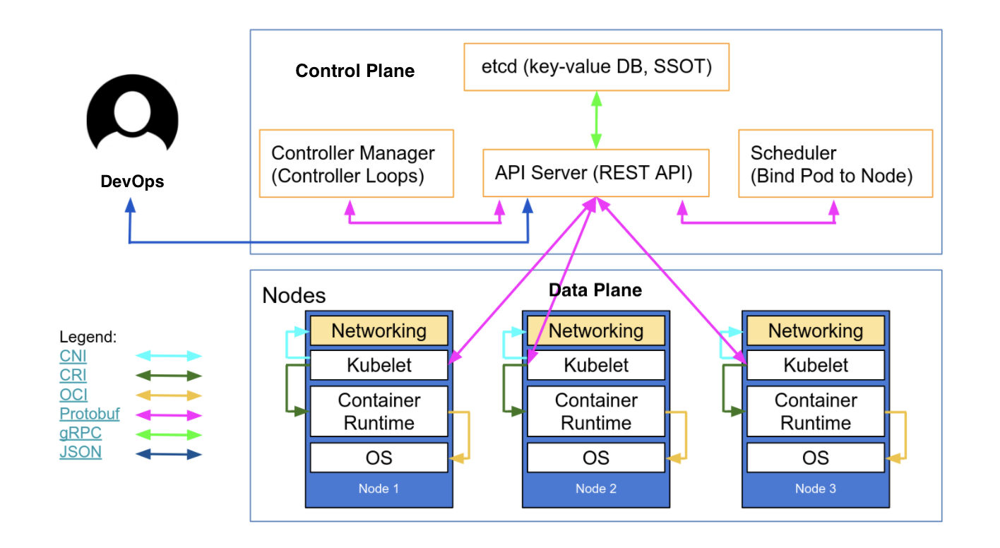
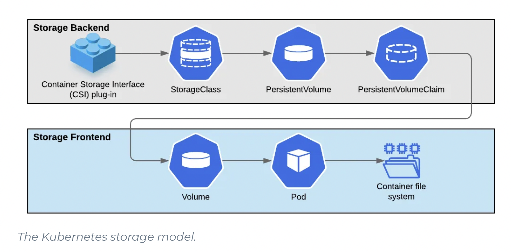
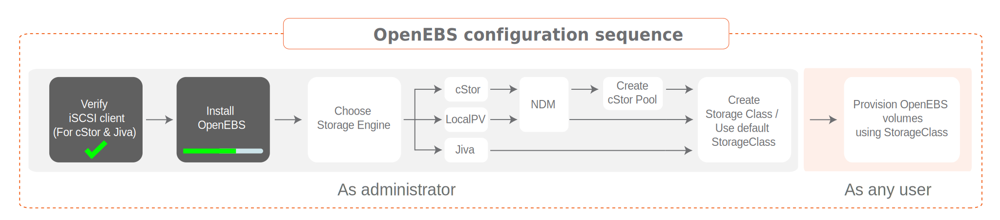

# :wheel_of_dharma: Kubernetes on Raspberry Pi 4

RaspberryPi 4 running a Kubernetes Cluster

# :wheel_of_dharma: Kubernetes on Metal

L'exercice dans cette section est de préparer sa grappe (cluster) que vous installerez sur du métal.

## :book: Table of Content

| Chapters                                  | Descriptions                                                       |
|-------------------------------------------|--------------------------------------------------------------------|
| [:o2: Naming](#o2-naming)                 | Creating and naming own cluster                                    |
| [:a: The preparation](#a-the-preparation) | Preparer a node                                                    |
| [:b: The components](#b-the-components)   | Install the components forming the cluster (tools and services)    |
| [:ab: The plans](#ab-the-plans)           | Deploy `kubernetes` control and data plans                         |
| [:joystick: Controlling the cluster](#joystick-controlling-the-cluster) |  Controlling the cluster remotely from a user station |
| [:floppy_disk: Data storing ](#floppy_disk-data-storing) | Store data on disks synchronized by a Storage Area Network (SAN) |
| [:rocket: The services](#rocket-the-services) | Enable applications to be delivered through services |
| [:chains: The network Infrastructure](#chains-network-infrastructure) | Defines the environment where the cluster evolves |


## :o2: Nommage

:busts_in_silhouette: Group Activity

Your cluster includes 4 nodes (servers) that you will first need to name

- [ ] Name your cluster :writing_hand:	 
- [ ] Create your DNS Zone with your domain provider (NS Record).
- [ ] After determining the name of your cluster:

:sagittarius: Name: sagittarius.gasy.africa

| Node Type     | Hostname                        |  IP                | Specs                 |
|---------------|---------------------------------|--------------------|-----------------------|
| control plane | rukbat.sagittarius.gasy.africa  | `192.168.1.200/24` | 4GB Ram,      4cores  |
| data plane    | nunki.sagittarius.gasy.africa   | `192.168.1.201/24` | 4GB Ram,      4cores  |
| data plane    | alnasl.sagittarius.gasy.africa  | `192.168.1.202/24` | 4GB Ram,      4cores  |
| data plane    | ascella.sagittarius.gasy.africa | `192.168.1.203/24` | 4GB Ram,      4cores  |

## :a: The preparation

:bust_in_silhouette: Individual Activity

#### :round_pushpin: The Node

- [ ] Its name
- [ ] Its `swap`
- [ ] Its `bridge`
- [ ] Its extra `modules` (Raspberry Pi)

[Preparation](.docs/Preparation.md) :writing_hand:	


## :b: The components

:bust_in_silhouette: Individual Activity

</img>

#### :round_pushpin: Installing tools

- [ ] Instal tools [:ice_cube: kubetools](.doc/kube-tools.md) :writing_hand: enabling the cluster management, like `kubeadm` and `kubectl`

#### :round_pushpin: Installing services

- [ ] Install the [CNI](https://kubernetes.io/docs/concepts/cluster-administration/networking/) (Container Network Interface) managed by the Service [:droplet: Kubelet](.doc/kubelet.md) :writing_hand:	 

- [ ] Install the [CRI](https://kubernetes.io/docs/setup/production-environment/container-runtimes/) (Container Runtime Interface)  defined by the [OCI](https://opencontainers.org) and managed by the Services:

| Services                                                  | 
|-----------------------------------------------------------|
| [:whale: Docker](.doc/docker.md) :writing_hand:           |
| [:whale2: Containerd](.doc/containerd.md) :writing_hand:	|

## :ab: The plans

:busts_in_silhouette: Group Activity

##### :control_knobs: The Control Plane

:warning: Make sure your domain has all the server names (nodes) linked to your cluster

- [ ] Install the [control plane](.doc/control-plane.md) :writing_hand:	 
- [ ] Initialize the pod network using the [CNI plugin](.doc/cni-plugin.md) :writing_hand: Cilium

:star2: But what is a [manifest](.doc/manifest.md) :writing_hand: ?

##### :abacus: The Data Plane

- [ ] Allow other nodes to [attach](.doc/data-plane.md) :writing_hand: the cluster.

## :joystick: Control the cluster

:busts_in_silhouette: Group Activity

:round_pushpin: Install the [:toolbox: tools](.doc/kube-tools-pc.md) :writing_hand: on your PC to manage the cluster

| Tools     | Description             |
|-----------|-------------------------|
| `kubectl` | Controlling the cluster |
| :package: `helm`    | Kubernetes Package Manager |
| :level_slider: `lens`    | IDE allowing the management of Kubernetes |

:round_pushpin: Put the `configuration` file in context to allow remote cluster management

- [ ] Install configuration file in [context](.doc/contexts.md) :writing_hand: `Kubernetes`

:round_pushpin:  Test its connection to the cluster

- [ ] Check that the current context points to `kubernetes-admin@kubernetes`

```
k config get-contexts
```
> Returns :
```yaml
CURRENT   NAME                          CLUSTER      AUTHINFO           NAMESPACE
*         kubernetes-admin@kubernetes   kubernetes   kubernetes-admin   
```

- [ ] Verify that the cluster is complete

```
k get nodes
```
> Returns :
```yaml
NAME     STATUS   ROLES           AGE   VERSION
nunki    Ready    <none>          18h   v1.27.1
rukbat   Ready    control-plane   22h   v1.27.1
```

- [ ] View cluster in :level_slider: `Lens`

:warning: Be careful not to install applications, the storage part is missing.

## :cl: The Storage Class

#### :roll_of_paper: The device (Block Device)

:bust_in_silhouette: individual activity to apply from :abacus: data plans:

The goal of the exercise is to create a disk or rather a logical volume and network it with `iSCSI`

- [ ] Install the [:minidisc: iSCSI](.doc/iscsi) :writing_hand: Service enabling a [SAN](https://en.wikipedia.org/wiki/Storage_area_network) implementation of the [`open- iscsi`](http://www.open-iscsi.com/) protocol
- [ ] Create the logical volume [:cd: lvm](.doc/iscsi/lvm.md) :writing_hand: called `iscsi-lv`
- [ ] Prepare the [device](.doc/iscsi/blockdevice.md) in block mode and save it in a `blockdevice-xxxx-xxx-xxx.md` file in your cluster directory.

#### :floppy_disk: Storage

[:bookmark: Container Storage](https://landscape.cncf.io/card-mode?category=cloud-native-storage&grouping=category)

:busts_in_silhouette: group activity to apply from the :control_knobs: control plane:

:round_pushpin: The kubernetes storage model

</img>

The Kubernetes standard allows infrastructure providers to use their own container storage engine or `CS` (Container Storage). For this, the Kubernetes standard provides an interface [CSI](https://kubernetes-csi.github.io/docs). This interface allows to use [Driver](https://kubernetes-csi.github.io/docs/drivers.html) or `Plugin` depending on the info-cloud or metal environment.

In our environment, we will choose [openEBS](https://openebs.io) and its `Storage Engine` [cStor](https://openebs.io/docs/user-guides/cstor) as `CSI Plugin `

 </img>

:round_pushpin: [Install](.doc/openebs/install.md) :pinching_hand: the `CSI Plugin` [openEBS](https://openebs.io)

:round_pushpin: Create the `standard` **Storage Class (sc)**

- [ ] Install the devices previously defined above
- [ ] Create a `pool` storage tank with the :three: devices
- [ ] Create `standard` **storage class (sc)** with `pool` storage tank

Use the following [admin operations](.doc/openebs/adminop.md) :pinching_hand:. for creating the **storage class (sc)** `standard`

:round_pushpin: You can now use the `standard` **storage class (sc)** defined by `default`

:bulb: Check that the **default** storage class is **standard**

```
kubectl get storageclasses        
```
> Retourne :
```yaml
NAME                 PROVISIONER            RECLAIMPOLICY   VOLUMEBINDINGMODE      ALLOWVOLUMEEXPANSION   AGE
openebs-device       openebs.io/local       Delete          WaitForFirstConsumer   false                  19m
openebs-hostpath     openebs.io/local       Delete          WaitForFirstConsumer   false                  19m
standard (default)   cstor.csi.openebs.io   Delete          Immediate              true                   2m35s
```


## :rocket: The Services

[:bookmark: Service](https://kubernetes.io/fr/docs/concepts/services-networking/service/)

:busts_in_silhouette: group activity

##### :control_knobs: The control plane

- [ ] [Install](.doc/openelb.md) :pinching_hand: [openelb](https://openelb.io/).

## :clapper: Applications

:bust_in_silhouette: Individual Activity

Each student will have to install his/her applications in the cluster

- [ ] Install apps with [LENS](https://k8slens.dev/)
- [ ] Enable :rocket: the service by applying the `annotations` related to the Porter `Load Balancer` according to the [Configuration](https://github.com/CollegeBoreal/Tutorials/tree/main/2.MicroServices/3.Orchestration/1.Kubernetes/C.Cluster/0.Local/6.K8s/apps) examples of the following applications
- [ ] Attach the application to your domain name

## :chains: Network Infrastructure

- [ ]  [Local Network](.doc/network.md) :pinching_hand:

## :rocket: Services

[:bookmark:Service](https://kubernetes.io/fr/docs/concepts/services-networking/service/)

# References


